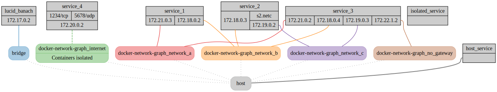

# Docker Network Graph

Visualize the relationship between Docker networks and containers
as a neat graphviz graph.

This repository fork [MuratovAS/docker-network-graph](https://github.com/MuratovAS/docker-network-graph)
Changes:
- Improved design
- Added the ability to generate url
- Added display of connections with the host
- Visualization of ports
- Github package

## Example


## Usage
```bash
    usage: docker-network-graph.py [-h] [-v] [-o OUT] [-u]
    Visualize docker networks.
    optional arguments:
      -h, --help         Show this help message and exit
      -v, --verbose      Verbose output
      -o OUT, --out OUT  Write output to file [not supported by container]
      -u, --url          Generate link for GraphvizOnline
```

## Running inside docker
If you want to generate a graph for a remote system you can also easily
run this script inside a pre-built docker container:

build container

```bash
    docker build . -t code.brothertec.eu/simono41/docker-network-graph:latest
```

and create a PNG

```bash
    docker run --rm -v /var/run/docker.sock:/var/run/docker.sock code.brothertec.eu/simono41/docker-network-graph:latest | dot -Tpng -o out.png
```

or as SVG

```bash
    docker run --rm -v /var/run/docker.sock:/var/run/docker.sock code.brothertec.eu/simono41/docker-network-graph:latest | dot -Tsvg -o out.svg
```

For more advanced use cases you can append arguments to the `docker run`
command as if you were running it in a local shell.

## Running local
In most cases what you want to run are the following couple commands:

```bash
git clone https://code.brothertec.eu/simono41/docker-network-graph.git
cd docker-network-graph
pipenv install
pipenv run python docker-network-graph.py -o output.svg
```

This will generate an .svg file containing the graph.

This will just generate and output the graph in the [DOT Language][dot].
You can then paste that code into [GraphvizOnline][gvonline]
to render it. The recommended rendering engine is `fdp`.

Alternatively, if you prefer to render locally, you can run
`fdp -Tpng -o out.png` on a system with graphviz installed,
paste the previous output there, press enter and finally CTRL+C to
generate the file.

## Development
If you'd like to contribute to this project, there is a sample docker-compose file
using dummy containers in `test`.

You can deploy it using 
```bash
docker-compose -f docker-compose.yml up -d
```

## Credit

[dot lang](https://www.graphviz.org/doc/info/lang.html)

[gvonline](https://dreampuf.github.io/GraphvizOnline/)
